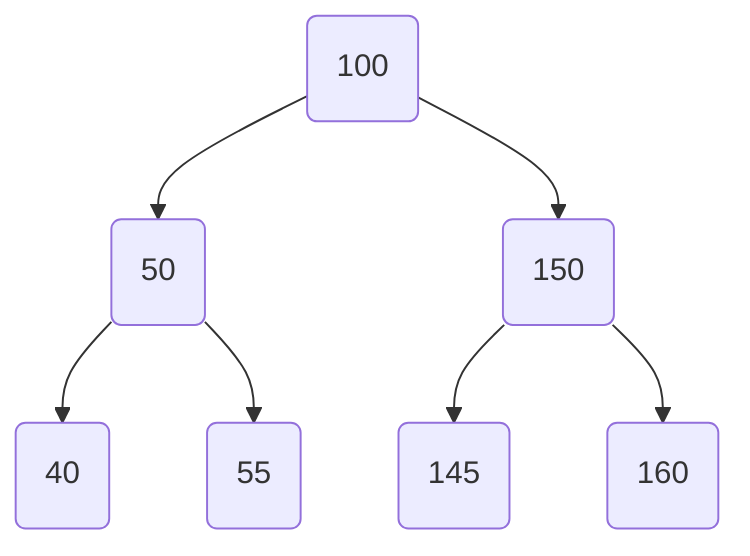

# Binary Search Tree

`Binary Search Tree` is a node-based data structure with following rules:
-  every node has the following properties:
    - Value
    - Pointer to left child (can be `NULL`)
    - Pointer to right child (can be `NULL`)
- the left subtree of a node always contains only nodes with values smaller than the node's value
- the right subtree of a node always contains only nodes with values greater than the node's value




**Definitions:**

- `root`: first Node of a binary search tree
- `node`: single element which contains a value and 0 to 2 pointers to child nodes
- `parent node`: node which has 1 or 2 children nodes
- `child node`: node which has a parent node
- `leaves`: nodes which have no children (no pointers to children)

## Insert new Node in Binary Search Tree

_Recursive calls, until there is a free pointer (`== nil`) for a new node._

```go
func (n *Node) Insert(data int) {
	if data < n.Data {
		if n.LeftChild == nil {
			n.LeftChild = New(data)
		} else {
			n.LeftChild.Insert(data)
		}
	} else if data > n.Data {
		if n.RightChild == nil {
			n.RightChild = New(data)
		} else {
			n.RightChild.Insert(data)
		}
	} else {
		fmt.Printf("%d already in binary search tree\n", data)
	}
}
```

## Search value in Binary Search Tree

_Recursive calls, which checks node values and moves accordingly left or right to child to find value._

```go
func (n *Node) Search(data int) (bool, *Node) {
	if n == nil {
		return false, nil
	} else if data < n.Data {
		return n.LeftChild.Search(data)
	} else if data > n.Data {
		return n.RightChild.Search(data)
	}
	return true, n
}
```