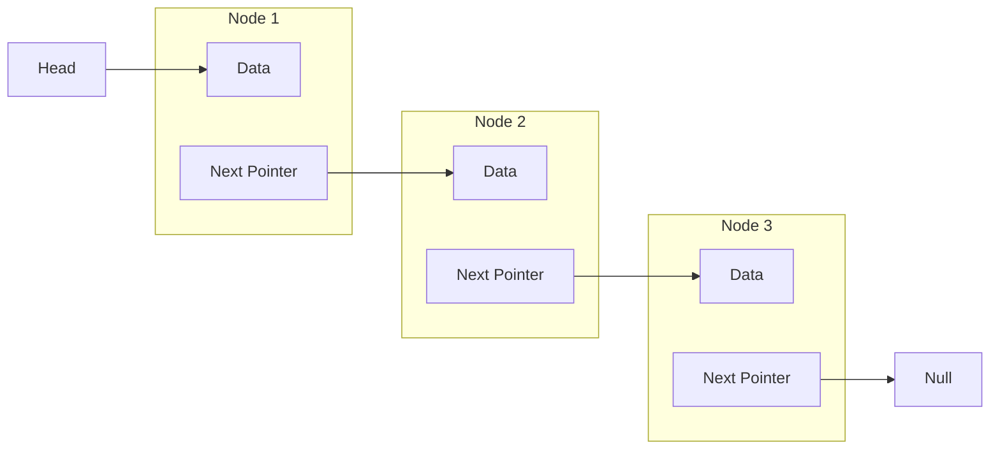

# Linked List

A `Linked List` is a node-based structure which is linear. Each element (node) has a data and a next field which points to the next node (or nil at the end). 
Therefore, the nodes do not have to be stored at contiguous memory locations.



**Pointers:**

- `Head`: this is the entry point and points to first node
- `Next`: points to the next node

## Insert new Node in Linked List

_Iterates through list until `next` points to nil. Insert new node at the end of linked list._

```go
func (l *LinkedList) Add(data int) {
	node := &Node{Value: data, Next: nil}

	if l.HEAD == nil {
		l.HEAD = node
		return
	}

	curr := l.HEAD
	for curr.Next != nil {
		curr = curr.Next
	}
	curr.Next = node
}
```

## Search Node in Linked List

_Iterates through list until `next` points to correct value or nil._

```go
func (l *LinkedList) Search(data int) bool {
	curr := l.HEAD

	if curr.Value == data {
		return true
	}

	for curr.Next != nil {
		curr = curr.Next

		if curr.Value == data {
			return true
		}
	}

	return false
}
```

## Remove Node form Linked List
