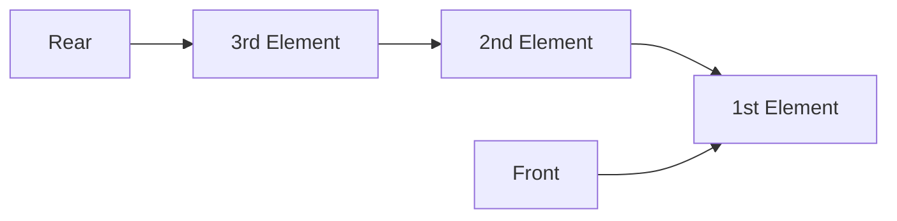

# Queue

A queue is a linear data structure with a fixed order. First enqueued node to queue is first dequeued node from queue.



**Pointers:**
- `Front`: points always to first node (which will be dequeued next)
- `Reard`: points always to last node (which was enqueued last)
- `Previous`: node pointer which points to previous node (node which was added after current node)

## Enqueue new data to queue

_Enqueue data to queue and move `Rear` pointer to added node. If node is first in queue move `Front` pointer to node._

```go
func (q *Queue) Enqueue(data int) {
	n := &Node{data, nil}
	if q.Front == nil && q.Rear == nil {
		q.Front = n
		q.Rear = n
	} else {
		q.Rear.Previous = n
		q.Rear = n
	}

	q.QueueSize++
}
```

## Dequeue data from queue (dequeue first added node)

_Dequeue data from queue, get value from `Front` pointer and move `Front` pointer to `node.Previous` pointer_

```go
func (q *Queue) Dequeue() (int, bool) {
	if q.Front == nil {
		return 0, false
	}

	n := q.Front
	if q.QueueSize == 1 {
		q.Front = nil
		q.Rear = nil
	} else {
		q.Front = n.Previous
	}

	q.QueueSize--
	return n.Value, true
}
```

## Peek data form queue (peek first added node)

_Peek data from queue, get value from `Front` pointer_

```go
func (q *Queue) Peek() (int, bool) {
    if q.Front == nil {
        return 0, false
    }
    return q.Front.Value, true
    }
```