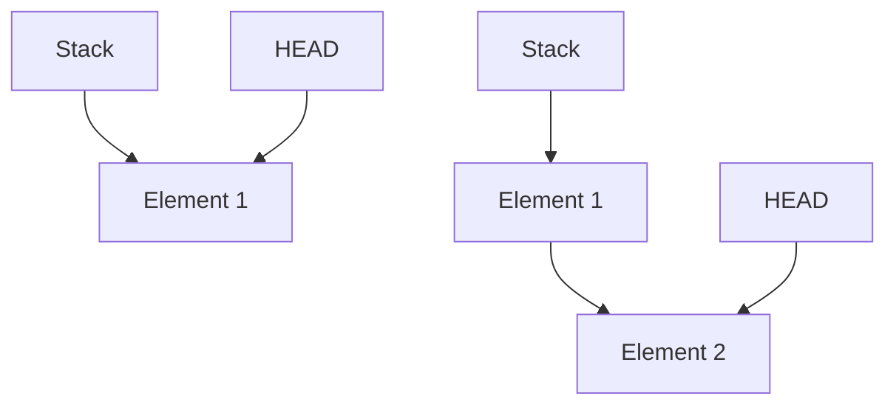

# Stack

A stack is a linear data structure with a fixed order. Last item pushed to stack is first item popped from stack.



## Push new data to stack

_Push data to stack and move `HEAD` pointer to added Node_

```go
func (s *Stack) Push(data int) {
	n := &Node{data, s.Head}
	s.Head = n
	s.StackSize++
}
```

## Pop data from stack (pop last added item)

_Pop data from stack and move `HEAD` pointer to second last added Node_

```go
func (s *Stack) Pop() (int, bool) {
	if s.Head == nil {
		return 0, false
	}

	p := s.Head
	s.Head = p.Previous
	s.StackSize--
	return p.Value, true
}
```

## Peek data from stack (peek last added item)

_Peek data from stack, get value from `HEAD` pointer_

```go
func (s *Stack) Peek() (int, bool) {
	if s.Head == nil {
		return 0, false
	}

	return s.Head.Value, true
}
```