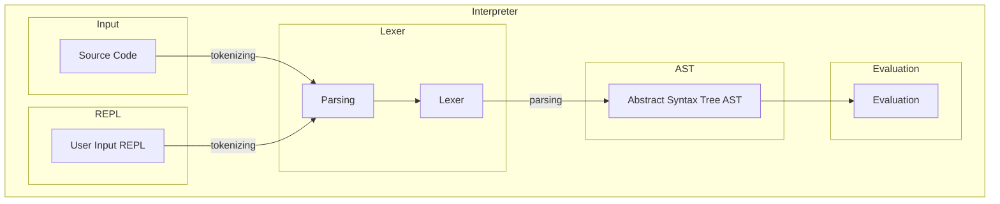
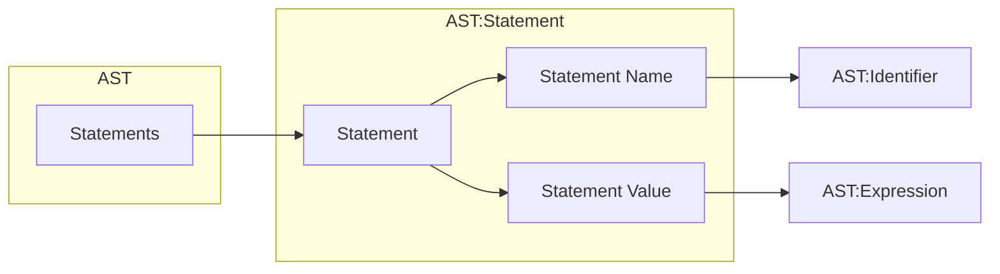

# emily-script

This sub-folder includes my experiments with creating an own scripting language `emily-script` (`em`). I took [«Writing an interpreter in go»](https://interpreterbook.com/) by Thorsten Ball as a guide to understand the underlying logic of a scripting language and its challenges.

## Structure



### Token

Defining tokens for the `emily-script` language. These are later used for parsing and lexing.

Some of the most important tokens:
- ILLEGAL: undefined tokens 
- EOF: end of file
- IDENT: identifier
- INT: integers
- ASSIGN: equals (=)
- COMMA: ,
- SEMICOLON: ;
- LPAREN: (
- RPAREN: )

### Lexer

A Lexer parses the input code char by char and identifies the associated token.

### Repl

REPL (read eval print loop) reads input, evaluates it and prints the result/tokens in a loop.

### Ast

AST (abstract syntax tree) is a data structure to represent the input code in a logical tree.

**Differences `statements` vs `expression`:**
> `expressions` produce values but `statements` not



Examples:

```em
// doesnt produce values -> statement
let test = 10;
return x

// produce values -> expression
5;
add(1, 2);
```
